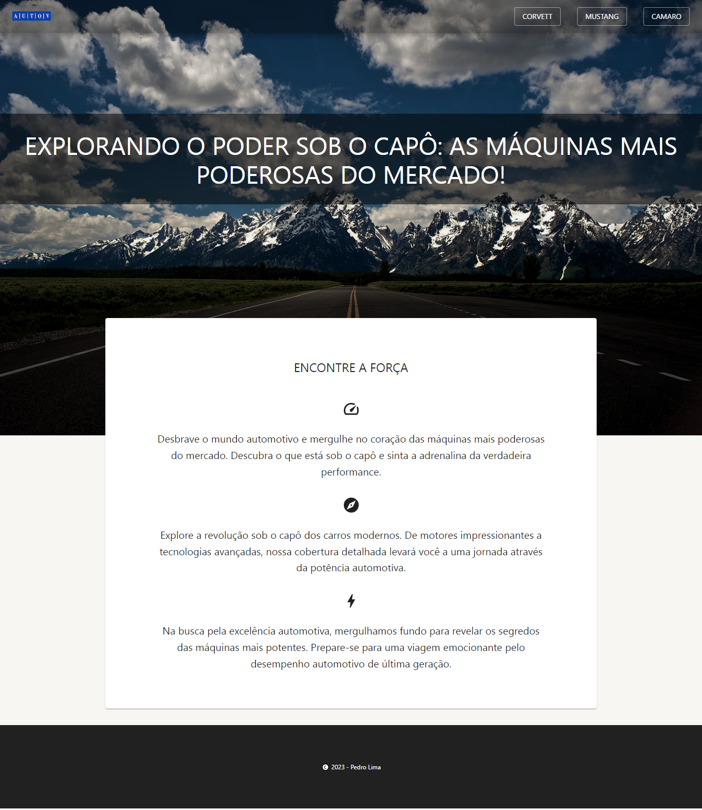

# AutoV

Uma aplicação de página única (SPA) de carros esportivos, com versão mobile e desktop.

O projeto é de minha autoria e foi inspirado em outras aplicações existentes, adaptando seus designs e recursos. A aplicação foi construída utilizando as tecnologias TypeScript, Next, Material-UI (MUI).

## Screenshots



</br>

## 🎯 Objetivos

O objetivo deste projeto foi desenvolver a aplicação com Next, utilizando a linguagem TypeScript e estilização com Material-UI.

Os usuários podem:
> - Visualizar a aplicação independente do seu dispositivo mobile ou desktop

</br>

## 🔧 Propriedades e Tecnologias

> - TypeScript
> - Next 
> - Material-UI (MUI)

</br>

## 🧠 Meu aprendizado

<!-- O principal desafio desse projeto certamente foi criar e configurar um servidor. Minha base de estudos é pautada por JavaScript. Nada como buscar ter meu primeiro contato com o back-end usando uma linguagem familiar, dessa forma, o Node me ajudou bastante, já que essa linguagem é essencialmente o JavaScript do lado do servidor.

```js
const express = require("express")
const newsRouter = require("./routes/news")
const topNewsRouter = require("./routes/top-news")
const app = express()

const PORT = process.env.PORT || 4001

app.use("/news", newsRouter)
app.use("/top-news", topNewsRouter)

app.listen(PORT, () => {
    console.log("Server running in port: " + PORT)
})
```

Com o auxílio do Express, podemos criar e configurar nosso servidor de maneira fácil. Primeiramente, é necessário instanciar o módulo Express, criar uma porta e executar o servidor usando a função 'listen()'. -->

</br>

## 💻 Rodando o projeto


Para conferir a versão final é só realizar os seguintes passos:

### 1 - Clonando o Projeto:
Abra o terminal com o GitBash.
Navegue até o diretório onde deseja clonar o projeto.
Execute o comando:

```bash
git clone URL_DO_REPOSITORIO
```
Substitua URL_DO_REPOSITORIO pela URL do repositório Git do seu projeto.

### 2 - Instalando Dependências:
Navegue até o diretório "autov".

Execute o comando:

```bash
npm install
```
ou
```bash
yarn install
```

### 3 - Executando o Projeto:
Navegue até o diretório "autov".

Execute o comando:

```bash
npm run dev
```
Isso iniciará o servidor de desenvolvimento Next.

</br>

## Autor

- LinkedIn - [Pedro A. Lima](https://www.linkedin.com/in/pedroalima6/)
